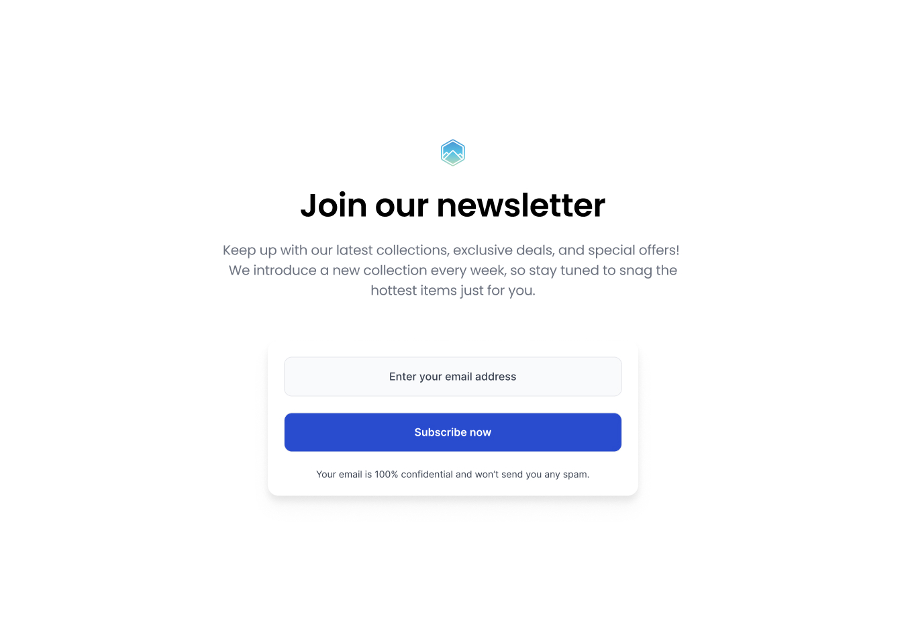

# Join Our Newsletter | devChallenges

  

  <b>Solution for the <a href="https://devchallenges.io/challenge/join-our-newsletter" target="_blank">Join Our Newsletter</a> challenge from <a href="https://devchallenges.io/" target="_blank">devChallenges.io</a></b>

---

## 📝 Overview

This project is a pixel-perfect implementation of the "Join Our Newsletter" challenge from devChallenges.io. The goal was to match the provided design as closely as possible using only semantic HTML and modern CSS. The result is a clean, accessible, and fully responsive newsletter sign-up page.

---

## ✨ Features

- Fully responsive layout for desktop, tablet, and mobile
- Custom styled input and button with focus and hover states
- Accessible and semantic HTML structure
- Modern, clean design with soft shadows and rounded corners
- Pixel-perfect match to the provided JPG design

---

## 🛠️ Built With

- HTML5
- CSS3 (no frameworks)

---

## 🚀 Getting Started

To view this project locally:

1. Clone the repository or download the source files.
2. Open `index.html` in your browser.
3. All assets are included in the `resources/` and `design/` folders.

---

## 🖼️ Screenshots

  
  
  

---

## 📚 What I Learned

- Advanced CSS layout techniques (flexbox, responsive design, media queries)
- How to match a design pixel-perfectly from a static image
- Customizing form elements for a modern, accessible look
- Using box-shadow, border-radius, and color for visual hierarchy
- The importance of semantic HTML for accessibility

---

## 🔗 Useful Resources

- [devChallenges.io](https://devchallenges.io/) - Source of the challenge and design
- [CSS Tricks Flexbox Guide](https://css-tricks.com/snippets/css/a-guide-to-flexbox/) - For layout help
- [MDN Web Docs](https://developer.mozilla.org/en-US/docs/Web/CSS) - For CSS reference

---

## 👤 Author
Coded by **Ayokanmi Adejola**  
Challenge by [devChallenges.io](https://devchallenges.io/)
